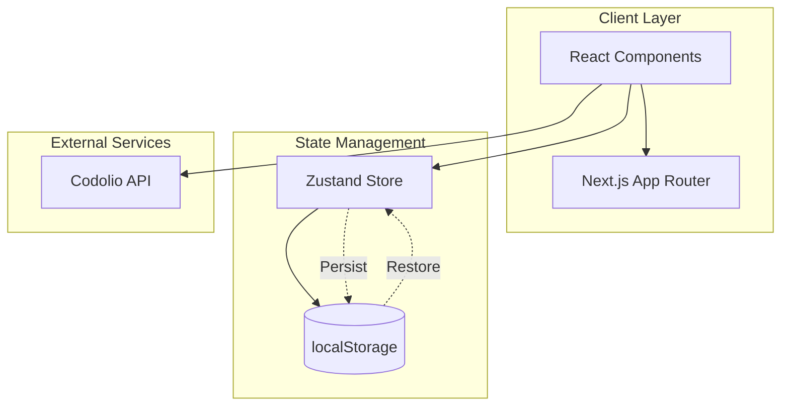
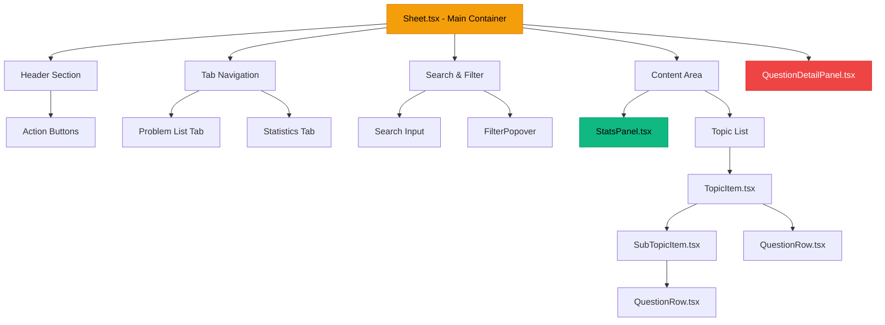
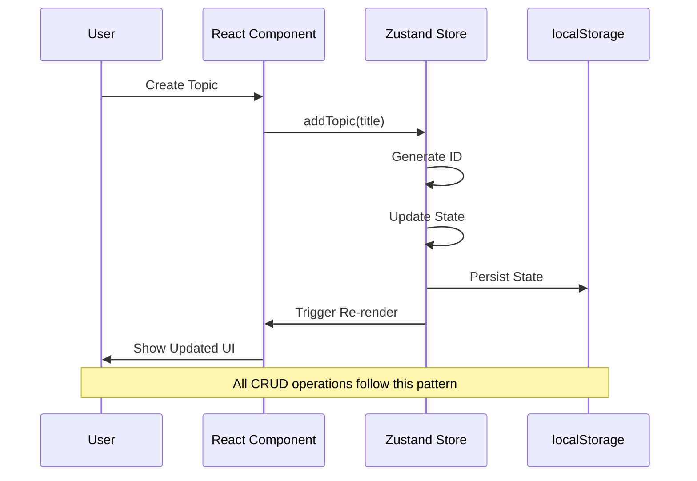
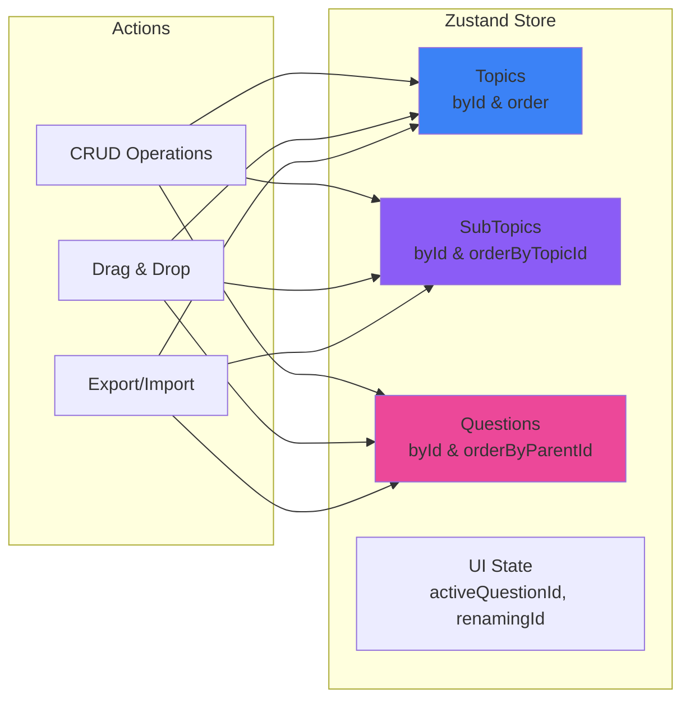
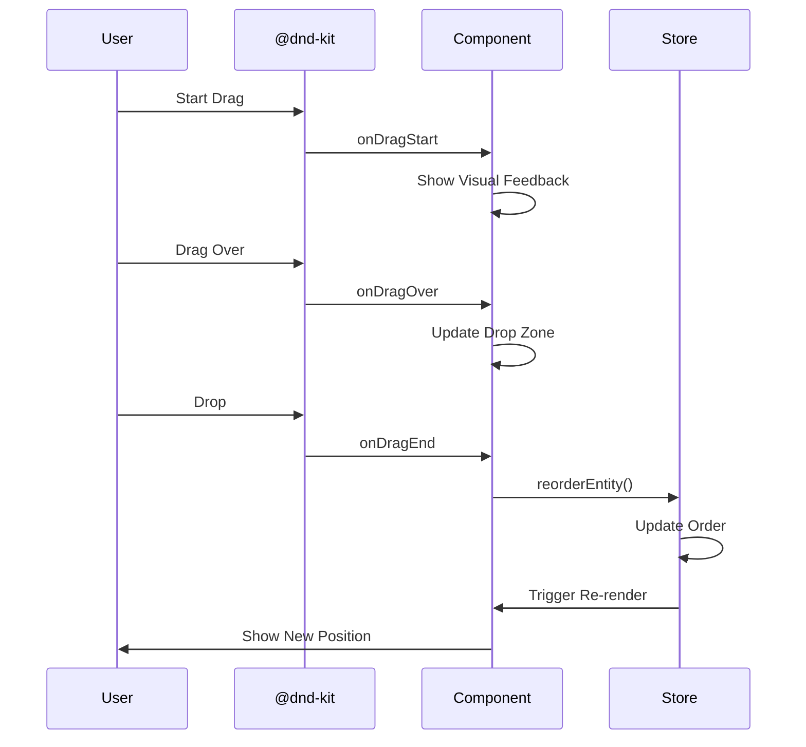
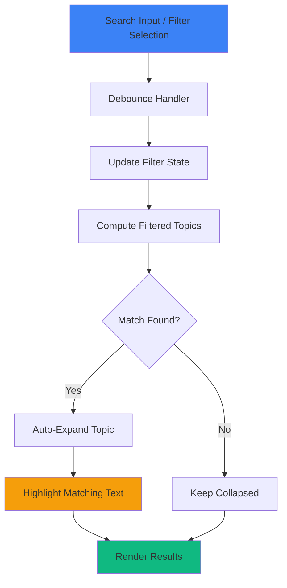
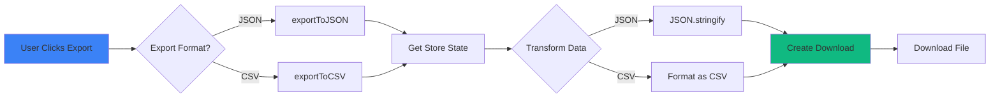

# 📚 Striver's SDE Sheet - Interactive Tracker

A **premium, production-ready** progress tracker for Striver's SDE Sheet with advanced features, stunning UI, and seamless user experience. Built with Next.js 14, Zustand, and modern web technologies.


---

## ✨ Features Overview

### 🎯 Core Functionality
- ✅ **Full CRUD Operations** - Create, Read, Update, Delete topics, subtopics, and questions
- ✅ **Drag & Drop** - Intuitive reordering with smooth animations using `@dnd-kit`
- ✅ **Progress Tracking** - Real-time visual progress bars and completion statistics
- ✅ **Local Storage Persistence** - Your data is automatically saved and restored
- ✅ **Inline Editing** - Double-click to edit titles directly
- ✅ **Auto-Expand on Creation** - New items automatically expand for immediate editing

### 🔍 Search & Filtering
- ✅ **Smart Search** - Search across all question titles with real-time results
- ✅ **Search Highlighting** - Matching text highlights in amber for easy identification
- ✅ **Multi-Filter Support** - Filter by:
  - Status (Todo/Done)
  - Difficulty (Easy/Medium/Hard)
  - Platform (LeetCode, GeeksforGeeks, InterviewBit, CodeStudio)
- ✅ **Context-Aware Expansion** - Topics auto-expand when filtered

### 📊 Statistics Dashboard
- ✅ **Animated Circular Progress** - Beautiful gradient progress indicator
- ✅ **Difficulty Breakdown** - Visual breakdown by Easy/Medium/Hard with color-coded bars
- ✅ **Platform Distribution** - Top 5 platforms with completion stats
- ✅ **Achievement Badges** - "On Fire!" badge when progress ≥ 50%
- ✅ **Smooth Animations** - Framer Motion animations throughout

### 💾 Data Management
- ✅ **Export to JSON** - Download your complete progress as JSON
- ✅ **Export to CSV** - Export for use in spreadsheets
- ✅ **API Integration** - Import official Striver's Sheet data via Codolio API

### ⚡ User Experience
- ✅ **Quick Status Toggle** - Click checkbox to instantly mark questions done/todo
- ✅ **Clickable Links** - Question URLs and video links open in new tabs with external link icons
- ✅ **Keyboard Shortcuts**:
  - `Ctrl+N` - Create new topic
  - `Ctrl+K` - Focus search
  - `Ctrl+E` - Toggle export menu
  - `Escape` - Close detail panel
- ✅ **Toast Notifications** - Real-time feedback for all actions
- ✅ **Responsive Design** - Works seamlessly on all screen sizes

### 🎨 Premium Design
- ✅ **Dark Mode UI** - Sleek, modern dark theme with amber accents
- ✅ **Glassmorphism Effects** - Frosted glass panels with backdrop blur
- ✅ **Gradient Accents** - Beautiful gradients throughout the interface
- ✅ **Micro-Animations** - Smooth transitions and hover effects
- ✅ **Platform Logos** - Custom SVG logos for LeetCode, GeeksforGeeks, etc.

---

## 🛠️ Tech Stack

| Category | Technology |
|----------|-----------|
| **Framework** | [Next.js 14](https://nextjs.org/) (App Router) |
| **Language** | [TypeScript](https://www.typescriptlang.org/) |
| **Styling** | [Tailwind CSS](https://tailwindcss.com/) |
| **State Management** | [Zustand](https://docs.pmnd.rs/zustand) with Persistence |
| **Drag & Drop** | [@dnd-kit](https://dndkit.com/) |
| **Animations** | [Framer Motion](https://www.framer.com/motion/) |
| **Icons** | [Lucide React](https://lucide.dev/) |
| **Notifications** | [Sonner](https://sonner.emilkowal.ski/) |
| **UI Components** | [shadcn/ui](https://ui.shadcn.com/) |

---

## 🚀 Getting Started

### Prerequisites
- **Node.js** 18.0 or higher
- **npm** or **yarn** package manager

### Installation

1. **Clone the repository**
   ```bash
   git clone <repository-url>
   cd codolio_assignment
   ```

2. **Install dependencies**
   ```bash
   npm install
   ```

3. **Run the development server**
   ```bash
   npm run dev
   ```

4. **Open in browser**
   Navigate to [http://localhost:3000](http://localhost:3000)

### Build for Production

```bash
npm run build
npm start
```

---

## 🐳 Docker Quick Start

### Using Docker (Production)

1. **Build the Docker image**
   ```bash
   docker build -t codolio-assignment:latest .
   ```

2. **Run the container**
   ```bash
   docker run -p 3000:3000 codolio-assignment:latest
   ```

3. **Open in browser**
   Navigate to [http://localhost:3000](http://localhost:3000)

### Using Docker Compose (Development)

1. **Start the development environment**
   ```bash
   docker-compose up
   ```

2. **Run in background**
   ```bash
   docker-compose up -d
   ```

3. **View logs**
   ```bash
   docker-compose logs -f
   ```

4. **Stop services**
   ```bash
   docker-compose down
   ```

> **Note**: Docker Compose mounts your source code for hot-reload during development.

### Environment Variables (Optional)

Currently, no environment variables are required. For future extensibility, create a `.env.local` file:

```env
# Optional: Custom API endpoint
NEXT_PUBLIC_API_URL=https://api.example.com

# Optional: Analytics
NEXT_PUBLIC_GA_ID=G-XXXXXXXXXX
```

---

## 📖 Usage Guide

### Creating Content

#### Add a Topic
1. Click the **"+ New Topic"** button in the header
2. Or press `Ctrl+N`
3. The topic will be created and auto-expanded for editing
4. Double-click the title to rename

#### Add a Subtopic
1. Hover over a topic
2. Click the **folder icon** (Add Subtopic)
3. Enter the subtopic name

#### Add a Question
1. Hover over a topic or subtopic
2. Click the **file icon** (Add Question)
3. Fill in question details in the detail panel:
   - Title
   - Difficulty (Easy/Medium/Hard)
   - Platform (LeetCode, GeeksforGeeks, etc.)
   - Question URL
   - Video URL
   - Notes (with markdown support)

### Managing Questions

#### Mark as Done/Todo
- Click the **circle/checkmark icon** next to any question
- Or toggle in the detail panel

#### Edit Question Details
- Click on any question to open the detail panel
- Edit all fields inline
- Changes save automatically

#### Reorder Items
- Drag and drop topics, subtopics, or questions
- Smooth animations show the new position

#### Delete Items
- Hover over any item
- Click the **trash icon**
- Confirm deletion in the toast notification

### Search & Filter

#### Search
1. Click the search box or press `Ctrl+K`
2. Type your query
3. Matching questions highlight in **amber**
4. Topics auto-expand to show results

#### Filter
1. Click the **filter icon** next to search
2. Select filters:
   - **Status**: Todo, Done
   - **Difficulty**: Easy, Medium, Hard
   - **Platform**: LeetCode, GeeksforGeeks, etc.
3. Click **"Clear Filters"** to reset

### View Statistics

1. Click the **"Statistics"** tab in the navigation
2. View:
   - Overall progress percentage
   - Solved vs. Remaining questions
   - Difficulty breakdown
   - Top platforms

### Export Data

1. Click the **download icon** in the header
2. Or press `Ctrl+E`
3. Choose format:
   - **Export to JSON** - Complete data structure
   - **Export to CSV** - Spreadsheet format

### Import Data

1. Click **"Import from Codolio"** in the header
2. Data from the official Striver's Sheet API will be imported
3. Existing data will be merged

---

## 📁 Project Structure

```
codolio_assignment/
├── app/                      # Next.js App Router
│   ├── layout.tsx            # Root layout
│   ├── page.tsx              # Home page
│   └── globals.css           # Global styles
├── components/               # React Components
│   ├── Sheet.tsx             # Main container with state
│   ├── TopicItem.tsx         # Topic component (draggable)
│   ├── SubTopicItem.tsx      # Subtopic component (draggable)
│   ├── QuestionRow.tsx       # Question row (draggable)
│   ├── QuestionDetailPanel.tsx  # Question editor panel
│   ├── StatsPanel.tsx        # Statistics dashboard
│   ├── FilterPopover.tsx     # Filter UI
│   ├── HighlightText.tsx     # Search highlighting
│   ├── SortableItem.tsx      # Drag wrapper
│   └── ui/                   # shadcn/ui components
├── store/                    # State Management
│   └── useStore.ts           # Zustand store with persistence
├── lib/                      # Utilities
│   ├── utils.ts              # Helper functions
│   ├── constants.ts          # Constants
│   ├── exportUtils.ts        # Export functionality
│   └── api.ts                # API integration
├── types/                    # TypeScript Types
│   └── index.ts              # Type definitions
└── public/                   # Static assets
```

---

## �️ Architecture

### System Architecture



### Component Hierarchy



### Data Flow



### State Management Structure



### Drag & Drop Flow



### Search & Filter Architecture



### Export Flow



---

## �🎯 Key Implementation Details

### State Management
- **Zustand** for global state with localStorage persistence
- Normalized data structure for efficient lookups
- Separate stores for topics, subtopics, and questions

### Drag & Drop
- **@dnd-kit** for accessible, performant drag-and-drop
- Supports reordering within and across containers
- Smooth animations with collision detection

### Data Persistence
- Automatic save to localStorage on every change
- Debounced saves for performance
- Restore on page reload

### Search Algorithm
- Real-time search across question titles
- Case-insensitive matching
- Highlights matching text with regex

### Export Formats
- **JSON**: Complete data structure with all relationships
- **CSV**: Flattened format with columns: Topic, Subtopic, Question, Status, Difficulty, Platform, Link

---

## 🎨 Design Philosophy

### Color Palette
- **Background**: `#09090b` (Deep black)
- **Surface**: `#1a1a1b` (Dark gray)
- **Primary**: `#f59e0b` (Amber)
- **Success**: `#10b981` (Emerald)
- **Danger**: `#ef4444` (Rose)

### Typography
- **Font**: System font stack for optimal performance
- **Weights**: 400 (normal), 600 (semibold), 700 (bold), 800 (extrabold)

### Animations
- **Duration**: 150-300ms for micro-interactions
- **Easing**: `ease-out` for natural feel
- **Framer Motion**: For complex animations

---

## 🔧 Configuration

### Environment Variables

**No environment variables are required** for basic functionality. The application works out of the box with:
- Local storage for data persistence
- Static data from `codolio_data.json`
- Client-side operations only

Optional environment variables for future features:
```env
NEXT_PUBLIC_API_URL=https://api.example.com
NEXT_PUBLIC_GA_ID=G-XXXXXXXXXX
```

### Customization
- Edit `tailwind.config.ts` for theme customization
- Modify `store/useStore.ts` for state structure changes
- Update `lib/constants.ts` for default values

### Docker Configuration
- `Dockerfile` - Multi-stage production build (~150MB)
- `Dockerfile.dev` - Development with hot-reload
- `docker-compose.yml` - Local development orchestration
- `.dockerignore` - Excludes unnecessary files

### CI/CD
- `.github/workflows/ci.yml` - Automated testing and linting
- `.github/workflows/code-quality.yml` - Security audits
- `.github/dependabot.yml` - Dependency updates

See [DEPLOYMENT.md](DEPLOYMENT.md) for detailed deployment instructions.

---

## 📝 Assignment Submission Notes

### Implemented Requirements
✅ **CRUD Operations** - Full create, read, update, delete for all entities
✅ **Drag & Drop** - Smooth reordering with `@dnd-kit`
✅ **Search & Filter** - Multi-field search with highlighting
✅ **Progress Tracking** - Visual statistics dashboard
✅ **Data Persistence** - localStorage integration
✅ **API Integration** - Codolio API import
✅ **Export** - JSON and CSV formats
✅ **Premium UI** - Modern, responsive design

### Bonus Features Implemented
✅ Keyboard shortcuts
✅ Search highlighting
✅ Platform filtering
✅ Clickable links
✅ Statistics dashboard with animations
✅ Toast notifications
✅ Inline editing
✅ Auto-expand on creation

### Testing the Application
1. **Create a topic** - Click "+ New Topic"
2. **Add questions** - Use the file icon
3. **Mark as done** - Click the checkbox
4. **Search** - Type in search box, see highlighting
5. **Filter** - Use filter popover
6. **View stats** - Click "Statistics" tab
7. **Export** - Download JSON/CSV
8. **Drag & drop** - Reorder items
9. **Keyboard shortcuts** - Try Ctrl+N, Ctrl+K, Ctrl+E

---

## 🐛 Known Limitations

- Undo/Redo not implemented (would require history stack)
- Import only supports Codolio API format
- No markdown rendering in notes (plain text only)
- No right-click context menu
- No multi-select for bulk operations

---

## 📄 License

MIT License - feel free to use this project for learning and personal use.

---

## 🙏 Acknowledgments

- **Striver** for the original SDE Sheet
- **Codolio** for the API integration
- **shadcn/ui** for beautiful components
- **Vercel** for Next.js framework

---

## 🚀 Deployment

### Vercel (Recommended)
[](https://vercel.com/new/clone)

1. Click the button above or connect your GitHub repository
2. Configure environment variables (if any)
3. Deploy automatically on every push to `main`

See [DEPLOYMENT.md](DEPLOYMENT.md) for detailed instructions.

### Docker Deployment

**Production:**
```bash
docker build -t codolio-assignment:latest .
docker run -p 3000:3000 codolio-assignment:latest
```

**Development:**
```bash
docker-compose up
```

### Other Platforms
- **Netlify**: Works with Next.js adapter
- **AWS**: Use Amplify or EC2 with Docker
- **DigitalOcean**: App Platform or Droplet with Docker

---

## 📧 Contact

For questions or feedback about this assignment submission, please contact the developer.

---

**Built with ❤️ for Codolio Assignment**
